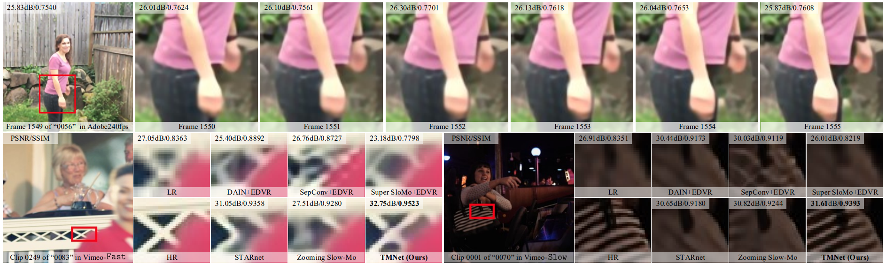

<p align="center">
  
</p>

This is the official PyTorch implementation of TMNet in the CVPR 2021 paper "[Temporal Modulation Network for Controllable Space-Time Video Super-Resolution](https://arxiv.org/abs/2104.10642)". Our TMNet can flexibly interpolate intermediate frames for space-time video super-resolution (STVSR). 

# Updates
- 2021.06.17 Dataset preparation for Adobe240fps and Vid4 Dataset
- 2021.05.08 Upload the code of training and testing.
- 2021.04.23 Init the repositories.

# Contents
0. [Introduction](#Introduction)
0. [Installation](#Installation)
0. [Train](#Train)
0. [Test](#Test)
0. [Results](#Results)
0. [Citation](#Testing)
0. [Acknowledgment](#Acknowledgment)
0. [Contact](#Contact)

# Introduction
Space-time video super-resolution (STVSR) aims to increase the spatial and temporal resolutions of low-resolution and low-frame-rate videos. Recently, deformable convolution based methods have achieved promising STVSR performance, but they could only infer the intermediate frame pre-defined in the training stage. Besides, these methods undervalued the short-term motion cues among adjacent frames. In this paper, we propose a Temporal Modulation Network (TMNet) to interpolate arbitrary intermediate frame(s) with accurate high-resolution reconstruction. Specifically, we propose a Temporal Modulation Block (TMB) to modulate deformable convolution kernels for controllable feature interpolation. To well exploit the temporal information, we propose a Locally-temporal Feature Comparison (LFC) module, along with the Bi-directional Deformable ConvLSTM, to extract short-term and long-term motion cues in videos. Experiments on three benchmark datasets demonstrate that our TMNet outperforms previous STVSR methods.

<p align="center">
  
</p>

<p align="center">
  
</p>

# Installation 
## Install the Requirement packages
- Python 3.6
- PyTorch >= 1.1
- NVIDIA GPU + CUDA
- [Deformable Convolution v2](https://arxiv.org/abs/1811.11168), we adopt [CharlesShang's implementation](https://github.com/CharlesShang/DCNv2) in the submodule.
- Python packages: ```pip install numpy opencv-python lmdb pyyaml pickle5 matplotlib seaborn```

## DCNv2
### 1. Clone the TMNet repository.
```
git clone https://github.com/CS-GangXu/TMNet.git
```

### 2. Compile the DCNv2 (```$ROOT``` means the working directory dir of the code of TMNet).
You should first set configuration of the ```$ROOT/models/modules/DCNv2/make.sh```
```
#!/usr/bin/env bash

# You may need to modify the following paths before compiling.
CUDA_HOME=/usr/local/cuda-10.0 \
CUDNN_INCLUDE_DIR=/usr/local/cuda-10.0/include \
CUDNN_LIB_DIR=/usr/local/cuda-10.0/lib64 \

python setup.py build develop
```
Then, run the ```make.sh```:
```
cd $ROOT/models/modules/DCNv2
bash make.sh
```

# Train
### 1. Dataset preparation 
You need to prepare datasets for following training and testing activities, the detailed information is at [Dataset Setup](data/README.md).

### 2. Get pretrained models
Our pretrained models (```tmnet_single_frame.pth``` and ```tmnet_multiple_frames.pth```) can be downloaded via [Link](https://drive.google.com/drive/folders/1PjXClB-S8pyB6y1UWJQnZK7fela5Lcu1?usp=sharing). After you download the pretrained models, please put them into the ```$ROOT/checkpoints``` folder.

### 3. Set up configuration
Our training settings in the paper can be found at ```$ROOT/configs/TMNet_single_frame.yaml``` and ```$ROOT/configs/TMNet_multiple_frames.yaml``` . We'll take these settings as an example to illustrate our training strategy in our paper.

### 4. Train the TMNet without the TMB block
We need to train the TMNet without the TMB block on the Vimeo-90K Septuplet dataset. Thus we need to follow the configuration in ```$ROOT/configs/TMNet_single_frame.yaml```.

If you want to train the TMNet without distributed learning:
```
python train.py -opt configs/TMNet_single_frame.yaml
```
If you want to train the TMNet with distributed learning ($GPU_NUMBER means the number of GPUs you used):
```
python -m torch.distributed.launch --nproc_per_node=$GPU_NUMBER train.py -opt configs/TMNet_single_frame.yaml --launcher pytorch
```

### 5. Fintune the TMB block
We need to fintune the TMB block for temporal modulation on the Adobe240fps dataset with the other parameters being fixed. Thus we need to follow the configuration in ```$ROOT/configs/TMNet_multiple_frames.yaml```.

If you want to train the TMNet without distributed learning:
```
python train.py -opt configs/TMNet_multiple_frames.yaml
```
If you want to train the TMNet with distributed learning ($GPU_NUMBER means the number of GPUs you used):
```
python -m torch.distributed.launch --nproc_per_node=$GPU_NUMBER train.py -opt configs/TMNet_multiple_frames.yaml --launcher pytorch
```

After training, the model, its training states and a corresponding log file are placed in the directory of ```$ROOT/experiments```.

# Test
You can evaluate the performance of the trained TMNet for single frame generation at the intermediate moment using the Vimeo-90k Septuplet dataset (for example, if we input a video with 30fps as the input, this code takes the generated video with 60fps for evaluation):
```
python test_single_frame.py
```
You can evaluate the performance of the trained TMNet for multiple (x6) frames generation using the Adobe240fps dataset (for example, if we input a video with 30fps as the input, this code takes the generated video with 180fps for evaluation):
```
python test_multiple_frames.py
```
All the evaluation results are placed in to ```$ROOT/evaluations```

# Results
## Quantitative Results
Comparison of PSNR, SSIM, speed (in fps), and parameters (in million) by different STVSR methods
on Vid4, Vimeo-Fast, Vimeo-Medium, Vimeo-Slow:
<p align="center">
  
</p>

## Visual Results
Qualitative and quantitative results of different methods on STVSR:

<p align="center">
  
</p>

Comparison of flexibility on STVSR by our TMNet (1-st, 3-rd, and 5-th columns) and Zooming Slow-Mo (2-nd, 4-th, and 6-th columns) on three video clips from the Vimeo-Fast dataset:

<p align="center">
  
</p>

Temporal consistency of our TMNet on STVSR:

<p align="center">
  
</p>

# Citation
If you find the code helpful in your research or work, please cite our paper.
```BibTeX
@InProceedings{xu2021temporal,
  author = {Gang Xu and Jun Xu and Zhen Li and Liang Wang and Xing Sun and Mingming Cheng},
  title = {Temporal Modulation Network for Controllable Space-Time Video Super-Resolution},
  booktitle = {IEEE/CVF Conference on Computer Vision and Pattern Recognition (CVPR)},
  month = {June},
  year = {2021}
}
```

# Acknowledgment
Our code is built on [Zooming-Slow-Mo-CVPR-2020](https://github.com/Mukosame/Zooming-Slow-Mo-CVPR-2020) and [EDVR](https://github.com/xinntao/EDVR). We thank the authors for sharing their codes.

# Contact
If you have any questions, feel free to E-mail me with [gangxu@mail.nankai.edu.cn](gangxu@mail.nankai.edu.cn).

# License

The code is released under the Creative Commons Attribution-NonCommercial-ShareAlike 4.0 International Public License for NonCommercial use only. Any commercial use should get formal permission first.
